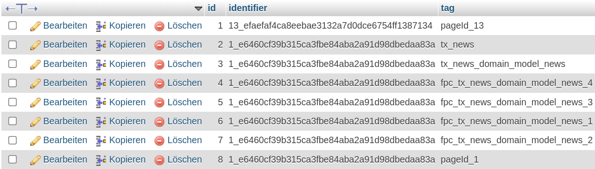

.. include:: ../Includes.txt

.. _concept:

Concept
=======

Before I talk about the concept of **fluid_page_cache** I would like to explain the functionality of the page cache
in TYPO3 CMS in general.

Page Cache in TYPO3
-------------------

TYPO3 deals with many caches and comes with an own Caching Framework. The **page cache** is one of the most important
and last caches during TYPO3's rendering processes. It caches the rendered HTML content of pages.

Extensions like `staticfilecache`_  take this cached content and put it to static HTML files,
which increases the performance, when accessing the website in frontend by browser, significantly.

.. _staticfilecache: https://extensions.typo3.org/extension/staticfilecache/

This only works, if the page **does not** contain USER_INT objects, which happens e.g. when your plugin has
non-cachable actions configured, in ``ext_localconf.php``.

The cHash
~~~~~~~~~

You've probably already dealt with the cHash. It is used for two things:

- prevent manipulating GET parameters (utilized by typoLink() method in ``\TYPO3\CMS\Frontend\ContentObject\ContentObjectRenderer``)
- identifying cache for current requested page

Here you can find how cHash is calculated: `CacheHashCalculator`_

.. _CacheHashCalculator: https://github.com/TYPO3/TYPO3.CMS/blob/master/typo3/sysext/frontend/Classes/Page/CacheHashCalculator.php

**Basically the calculation works like that:**

1. Collect all GET parameters
2. Add the configured "encryptionKey" (as salt)
3. Sort all values alphabetically by key
4. Remove parameters to be excluded from cHash (global TYPO3 configuration)
5. Create final md5 hash from serialized parameters array

This cHash is used as identifier. Each **page variation** get's its own identifier.

Page variations
~~~~~~~~~~~~~~~

A page variation is the same page in TYPO3 page tree, but displayed with different contents.

For example, the detail page of the news extension: Which is only one page, but displays various different news entries.
This is possible thanks to additional GET parameters, like `?tx_news_pi1[news]=123`.

Those parameters are important to be used, when calculating the cHash.

Example with news extension
~~~~~~~~~~~~~~~~~~~~~~~~~~~

.. note::
   Because of how Georg used the page cache in his news extension, I've had got the idea of this extension.

The following screenshots shows contents from database table **cf_cache_pages_tags**.

In this example I've created two news entries and called them separately in frontend (so the page cache is created).

We see two different identifiers, but several tags assigned to them. Basically each variant has three tags:

- pageId_0
- tx_news
- tx_news_uid_0

While pageId is provides by the TYPO3 core, the tx_news tags come from news itself.
They are set in detailAction of the NewsController.

With these page cache tags set, you can easily clear single page variants,
without affecting all other cached news' detail pages.

The problems
------------

- News did a great job, for news itself. But you need to implement the cache behaviour **on your own**, in your extensions
- News only set cache tags for news items itself (uid & pid), used children (e.g. sys_file_reference) are not creating
  an individual tag
- Which may lead to **cache issues** for editors, when they edit a relation or a sys_file out of the scope of current news
  entry (e.g. in Filelist)

**The question is:**
When you update an entity in backend, how to identify affected page variation,
in after-save-hook to clear the page caches?

The idea
--------

Instead of adding the cache tag for each entity manually in e.g. ``detailAction()`` of your extension,
why not do it automatically?

To achieve this, I need a place where I can create a list of entities, used on current page.
This place is the **rendering process of Fluid** templates, in which I've registered a new **node interceptor**
(thanks to Claus Due).

There, I am able to fetch every ``{whatever.property}`` you put in your Fluid templates/partials/layouts and check if
``whatever`` is an instance of ``\TYPO3\CMS\Extbase\DomainObject\AbstractDomainObject``.

Only those entities are registered for additional page cache tags, which are actually used in your Fluid template.
If your entities contain child objects, they are only generating a tag, when they are get used.

Benefits
--------

With this, you get create a **very precise tagging of page caches**, based on your view.

Now, an after-save-hook will clear the cache of **only those pages, which are really affected**. It does not matter how
the entity has been **reached into the view** (e.g. processors), it only matters that you've accessed it.

It is important, that the Fluid rendering context (variable container) knows about the entity you want to cache.
When you use view helpers, which provide own data (like ``f:cObject``), fluid_page_cache is unable to detect them automatically.

For such cases a view helper and a utility class is provided, which allows you to set a page cache tag entry manually.

fluid_page_cache works with **zero configuration**.

The process
-----------

The following diagram shows how fluid_page_cache creates a new bridge between Fluid templating engine and
TYPO3's FrontendController, which utilizes the page cache in first instance.

.. image:: Images/process.png
   :scale: 50%
   :alt: Diagram of how fluid_page_cache creates a new bridge between Fluid and TYPO3's FrontendController

Interested? Check out the next chapter "Installation".
