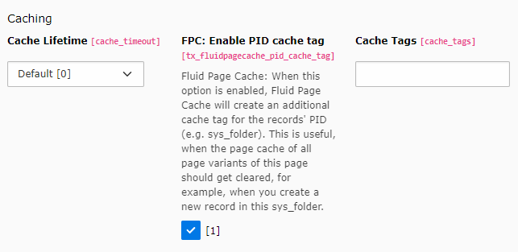

.. include:: ../Includes.txt

.. _usage:

Usage
=====

fluid_page_cache comes with zero configuration and works out of the box, when it is installed.

Info Module
-----------

fluid_page_cache ships an Info Module which allows you to see the records used in view, for each page variation in
page cache.

.. image:: ../Welcome/Images/info_module.png
   :scale: 50%
   :alt: Page cache tags in TYPO3

.. caution::
   The info module does not work for all Cache backends, yet.

**Supported cache backends are:**

- Typo3Database
- Redis
- SimpleFile

When you use e.g. APCU, the info module will not work.

The main functionality of fluid_page_cache is not affected. It supports all cache backends, the Caching Framework is
compatible with.

Handling new records
--------------------

fluid_page_cache works with zero configuration, but also adds a new option to pages cache options:

When this option is enable, Fluid Page Cache will create **an additional cache tag** for the records' PID
(e.g. sys_folder).

This is especially useful, when the page cache of all page variants of this page should get cleared,
for example when you **create a new record in a sys_folder**.

Therefore this option makes sense to enable for pages, which primarily contains
**lists of records** (with/without paginations).

If you not activate this option on such pages, a new record in a related sys_folder will have
**no effect to page cache** at all.

So, you **should not** enable this option for dedicated detail pages. Otherwise their cache would also get cleared,
when new records have been created.

Register cache tags manually
----------------------------

fluid_page_cache is just able to create cache tags for used entities in view,
when they get passed **into** the template using variables.

View helpers like ``f:cObject`` provide own data, which the variable container in Fluid does not know about.

View helper
~~~~~~~~~~~

To be still able to provide cache tags here, fluid_page_cache ships a view helper, you can use in your templates.

**Example Fluid template:**

.. code-block:: html

    {namespace fpc=T3\FluidPageCache\ViewHelpers}

    <f:cObject typoscriptObjectPath="lib.contentElementRendering">{element.uid}</f:cObject>
    <fpc:registerCacheTag table="tt_content" uid="{element.uid}" pid="{element.pid}" />

PageCacheManager class
~~~~~~~~~~~~~~~~~~~~~~

The central class ``\T3\FluidPageCache\PageCacheManager`` is entry point for all parts of this extension.

You can call the static method **registerCacheTag** from everywhere you want.

.. code-block:: php

    PageCacheManager::registerCacheTag($table, $uid, $pid);

Keep in mind, that fluid_page_cache only apply:

- when ``TYPO3_MODE`` constant is ``FE``
- ``$GLOBALS['TSFE']`` is set

The pid is used to create an additional cache tag for the related e.g. sys_folder. It only applies when
the setting ``tx_fluidpagecache_pid_cache_tag`` in page settings, is enabled.

If you want to register an Extbase entity manually, you can use the static **registerEntity** method:

.. code-block:: php

    $entity = $this->myRepository->findByUid(1);
    PageCacheManager::registerEntity($entity);

``$entity`` must be:

- an instance of ``\TYPO3\CMS\Extbase\DomainObject\AbstractDomainObject``
- persisted (and have an uid available)

All cache tags made with fluid_page_cache got this syntax:
``fpc_{table_name}_{uid}``

``{table_name}`` may also store the keyword ``pid``, which is related to ``tx_fluidpagecache_pid_cache_tag`` option
in page settings.

DataHandler Hook
----------------

Creating cache tags does only make sense when you use them to clear specific cache entries.

fluid_page_cache provides an after-save-hook, which is triggered each time you modify a record using the DataHandler
(e.g. editors in backend).

When a new record is created, e.g. in a sys_folder, the cache tag ``fpc_pid_{uid of current page}`` is cleared.
This cache tag only applies to pages, which have the setting **FPC: Enable PID cache tag** enabled.

It applies automatically, when fluid_page_cache is installed.
